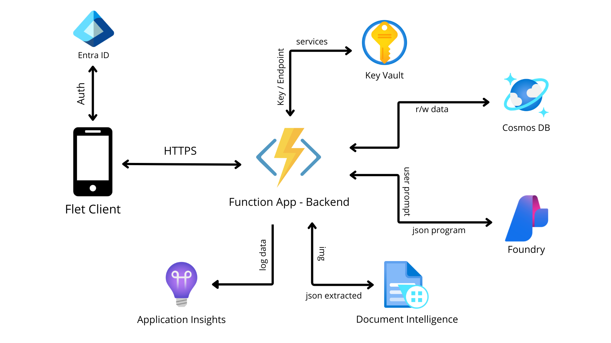

Progetto sviluppato per il corso di Cloud Computing dell’Università degli Studi di Salerno.

# GymLog

**GymLog** è un’Android app sviluppata in Python (Flet) per digitalizzare, gestire e monitorare i propri allenamenti in palestra.

Le funzionalità principali dell'app includono:

* **Gestione Utente & Dashboard:** Login sicuro tramite Microsoft Account (Entra ID). Gestione dati fisici con calcolo automatico di BMI e BMR direttamente nella Dashboard.
* **Gestione Schede:** CRUD completo (Inserimento, Modifica, Consultazione, Eliminazione) delle schede di allenamento. Gestione database esercizi personali e di sistema (Inserimento/Eliminazione).
* **Scanner e Coach AI:** Digitalizzazione di schede cartacee tramite foto (OCR Strutturato) e generazione automatica di nuove programmazioni basate su prompt utente tramite AI (GPT-4o Mini).
* **Live Tracking & Storico:** Logging in tempo reale di serie, ripetizioni e carichi durante l'esecuzione della scheda. Consultazione cronologica dello storico allenamenti e dei log registrati.

## Servizi Utilizzati

Il backend è interamente ospitato su Microsoft Azure:

* **Azure Function App** (Python V2 Model) con HTTP Trigger: funge da API Gateway e gestisce la logica di business.
* **Azure Cosmos DB (NoSQL):** utilizzato per la persistenza dei documenti JSON (Utenti, Schede, Log Allenamenti ed Esercizi)
* **Azure AI Document Intelligence:** utilizzato con il modello `prebuilt-layout` per l'estrazione strutturata di dati dalle immagini delle schede cartacee.
* **Azure AI Foundry:**  modello **GPT-4o Mini** con prompt ingegnerizzato per generare output JSON per le schede di allenamento.
* **Microsoft Entra ID:** gestisce l'autenticazione degli utenti tramite protocollo OAuth 2.0 (Device Code Flow) e libreria MSAL.
* **Azure Key Vault:** garantisce la sicurezza gestendo centralmente segreti, API Key ed Endpoint.
* **Azure Application Insights:** per il monitoraggio, logging distribuito e analisi delle performance.

## Architettura



## Guida all'utilizzo

### GymLog App (Client Flet)

L’app è stata sviluppata con il framework **Flet**  (v0.25.0 basato su Flutter) che permette di creare interfacce native partendo da codice Python. Può essere eseguita su Android, Web e Desktop.

#### Prerequisiti
* Python 3.10+
* Account Microsoft (per il login in-app)

#### Esecuzione
Per avviare l'applicazione tramite emulatore built-in di Flet basta eseguire il main.py

bash ```
    python main.py
    ```

Per compilare l'APK Android Flet richiede l'installazione dell'SDK Flutter e l'uso del comando `flet build apk`.
